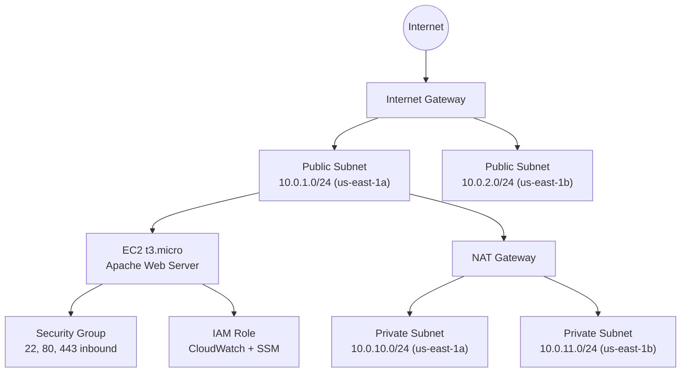

# AWS Cloud CI/CD with Terraform

Deploy a **complete CI/CD-ready infrastructure** on AWS with automated GitHub Actions pipelines.

## Prerequisites

| Tool | Minimum Version | Install |
|------|----------------|---------|
| Terraform | 1.5.0 | `brew install terraform` or [tfenv](https://github.com/tfutils/tfenv) |
| AWS CLI | 2.x | `brew install awscli` |
| Git | 2.x | included on most systems |

**GitHub Secrets required:**

| Secret | Description |
|--------|-------------|
| `AWS_ACCESS_KEY_ID` | IAM user access key with appropriate permissions |
| `AWS_SECRET_ACCESS_KEY` | IAM user secret key |
| `AWS_TF_STATE_BUCKET` | S3 bucket name for Terraform remote state |
| `AWS_TF_LOCK_TABLE` | DynamoDB table name for state locking |

**Local setup:**

```bash
# Copy backend config and fill in your values
cp backend.hcl.example backend.hcl

# Configure AWS credentials
aws configure

# Initialize and deploy
terraform init -backend-config=backend.hcl
terraform plan
terraform apply
```

## What This Demo Deploys

- **VPC**: Custom VPC with public and private subnets across 2 availability zones
- **NAT Gateway**: Secure outbound internet access for private subnets
- **Security Groups**: Stateful firewall rules (see security note below)
- **IAM Roles**: Least-privilege instance profiles with CloudWatch and SSM access
- **EC2 Instance**: Amazon Linux 2 with Apache auto-installed via user data
- **GitHub Actions CI/CD**: Automated plan, apply, and destroy jobs

## Architecture



## Modules

| Module | Purpose |
|--------|---------|
| `vpc` | VPC, subnets, Internet Gateway, NAT Gateway, route tables |
| `security-group` | Ingress/egress rules for EC2 |
| `iam` | Instance profile, CloudWatch Logs, SSM permissions |
| `compute` | EC2 instance with latest Amazon Linux 2 AMI |

## Cost Estimate

| Resource | Hourly | Monthly (est.) |
|----------|--------|----------------|
| EC2 t3.micro | $0.0104 | ~$7.50 |
| NAT Gateway | $0.045 + data | ~$33+ |
| EBS 20GB gp3 | N/A | ~$1.60 |
| **Demo total (1hr)** | **~$0.07** | N/A |

> Destroy after demos to avoid ongoing NAT Gateway charges (~$0.045/hr).

## Key Outputs

```bash
terraform output -json
```

| Output | Description |
|--------|-------------|
| `vpc_id` | VPC resource ID |
| `public_subnet_ids` | List of public subnet IDs |
| `private_subnet_ids` | List of private subnet IDs |
| `security_group_id` | Security group ID |
| `instance_public_ip` | EC2 public IP (visit in browser for Apache default page) |
| `instance_private_ip` | EC2 private IP |

Expected output after successful apply:

```
Apply complete! Resources: 18 added, 0 changed, 0 destroyed.

Outputs:

instance_public_ip = "54.x.x.x"
vpc_id = "vpc-0abc123..."
```

## Security Note

> **Security rules are intentionally relaxed for demo accessibility.**
> SSH (22), HTTP (80), and HTTPS (443) are open to `0.0.0.0/0` so the demo can
> be accessed immediately after deployment. Before using this pattern in production,
> restrict SSH to known CIDR ranges and route HTTP/HTTPS through a load balancer
> or WAF. See inline comments in `modules/security-group/main.tf`.
