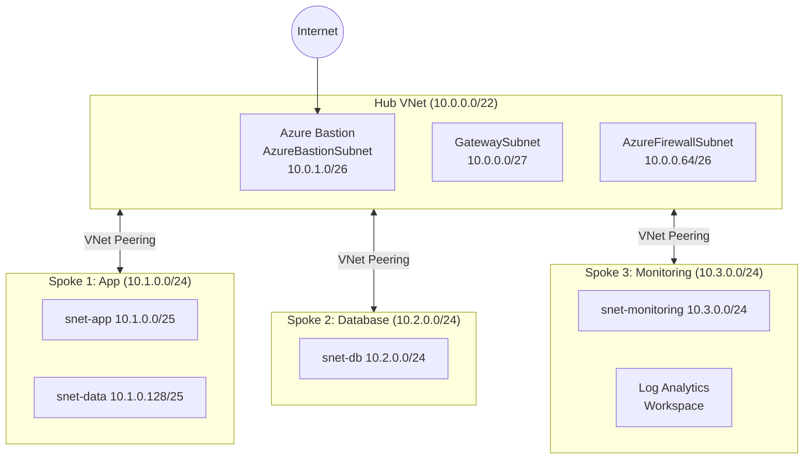

# Azure Hub-Spoke Architecture with Bicep

Deploy a **production-ready hub-spoke network topology** with Azure Bicep for multi-workload isolation and centralized security.

## Prerequisites

| Tool | Minimum Version | Install |
|------|----------------|---------|
| Azure CLI | 2.50+ | `brew install azure-cli` |
| Bicep CLI | latest | `az bicep install` |
| Git | 2.x | included on most systems |

**GitHub Secrets required:**

| Secret | Description |
|--------|-------------|
| `AZURE_CREDENTIALS` | Service principal JSON from `az ad sp create-for-rbac` |

**Local setup:**

```bash
# Log in to Azure
az login

# Create resource group
az group create --name rg-brava-hub-spoke-demo --location eastus

# Validate (what-if, no changes made)
az deployment group what-if \
  --resource-group rg-brava-hub-spoke-demo \
  --template-file main.bicep \
  --parameters parameters.bicepparam

# Deploy
az deployment group create \
  --resource-group rg-brava-hub-spoke-demo \
  --template-file main.bicep \
  --parameters parameters.bicepparam

# Destroy
az group delete --name rg-brava-hub-spoke-demo --yes
```

## What This Demo Deploys

- **Hub VNet**: 10.0.0.0/22 with GatewaySubnet, AzureFirewallSubnet, AzureBastionSubnet
- **3 Spoke VNets**: App (10.1.0.0/24), Database (10.2.0.0/24), Monitoring (10.3.0.0/24)
- **VNet Peering**: Full bidirectional hub-to-spoke peering across all 3 spokes
- **Azure Bastion**: Secure VM access with no public IPs on workload VMs
- **Log Analytics Workspace**: Centralized logging in the monitoring spoke

## Architecture



## Modules

| Module | Purpose |
|--------|---------|
| `hub-network.bicep` | Hub VNet, NSG, Azure Bastion with static public IP |
| `spoke-network.bicep` | Parameterized spoke VNet with dynamic subnet creation |
| `connectivity.bicep` | Bidirectional VNet peering (hub-to-spoke and spoke-to-hub) |

## Cost Estimate

| Resource | Hourly | Monthly (est.) |
|----------|--------|----------------|
| Azure Bastion (Basic) | ~$0.19 | ~$138 |
| VNet Peering (5 pairs) | minimal | ~$1-2 |
| Log Analytics Workspace | pay-per-GB | ~$0 for demos |
| **Demo total (1hr)** | **~$0.20** | N/A |

> Azure Bastion dominates cost. Destroy after demos: `az group delete --name rg-brava-hub-spoke-demo --yes`

## Key Outputs

After deployment, view all outputs:

```bash
az deployment group show \
  --resource-group rg-brava-hub-spoke-demo \
  --name main \
  --query properties.outputs
```

| Output | Description |
|--------|-------------|
| `hubVnetId` | Hub virtual network resource ID |
| `spoke1VnetId` | App spoke VNet ID |
| `spoke2VnetId` | Database spoke VNet ID |
| `spoke3VnetId` | Monitoring spoke VNet ID |
| `bastionPublicIp` | Bastion host public IP for RDP/SSH access |
| `bastionHostname` | Bastion hostname |
| `logAnalyticsWorkspaceId` | Log Analytics Workspace resource ID |
| `logAnalyticsWorkspaceName` | Workspace name for connecting diagnostic settings |

Expected output after successful deployment:

```json
{
  "bastionHostname": { "value": "brava-bastion-demo" },
  "hubVnetId": { "value": "/subscriptions/.../virtualNetworks/vnet-hub-demo" },
  "logAnalyticsWorkspaceName": { "value": "law-brava-demo" }
}
```

## Security Note

> **The SSH rule on the hub NSG is intentionally relaxed for demo accessibility.**
> In a real deployment, remove public SSH rules entirely and route all access
> through Azure Bastion. Note that no spoke VMs have public IPs in this architecture;
> all management traffic already flows through the hub.
