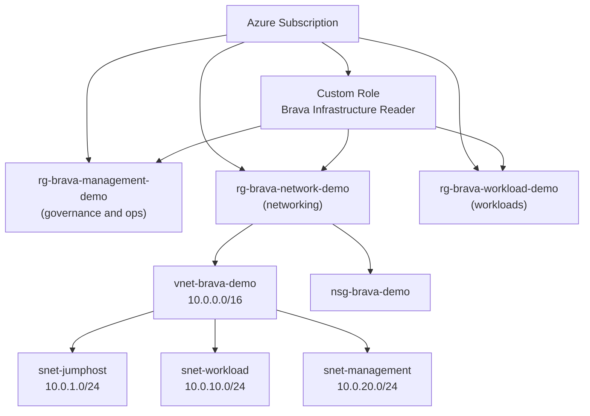

# Azure Landing Zone with Terraform Modules

Deploy an **enterprise-grade Azure landing zone** demonstrating governance, networking, and RBAC at scale.

## Prerequisites

| Tool | Minimum Version | Install |
|------|----------------|---------|
| Terraform | 1.5.0 | `brew install terraform` or [tfenv](https://github.com/tfutils/tfenv) |
| Azure CLI | 2.50+ | `brew install azure-cli` |
| Git | 2.x | included on most systems |

**GitHub Secrets required:**

| Secret | Description |
|--------|-------------|
| `AZURE_CREDENTIALS` | Service principal JSON from `az ad sp create-for-rbac` |

**Local setup:**

```bash
# Log in to Azure
az login

# Copy backend config and fill in your storage account name
cp backend.hcl.example backend.hcl

# Initialize and deploy
terraform init -backend-config=backend.hcl
terraform plan -var="azure_subscription_id=$(az account show --query id -o tsv)"
terraform apply -var="azure_subscription_id=$(az account show --query id -o tsv)"
```

## What This Demo Deploys

- **Three Resource Groups**: Management, Networking, Workload (governance pattern)
- **Virtual Network**: 10.0.0.0/16 with three segmented subnets
- **Network Security Group**: Baseline inbound rules (see security note below)
- **Custom RBAC Role**: "Brava Infrastructure Reader" scoped to all three resource groups
- **Role Assignment**: Assigned to the deploying service principal via `for_each`

## Architecture



## Modules

| Module | Purpose |
|--------|---------|
| `resource-group` | Consistent RG creation with naming conventions and tags |
| `network` | VNet, dynamic subnets, NSG with baseline rules |
| `rbac` | Custom role definition and assignment across all resource groups |

## Cost Estimate

| Resource | Hourly | Monthly (est.) |
|----------|--------|----------------|
| Virtual Network | $0.00 | $0.00 |
| Subnets / NSG | $0.00 | $0.00 |
| RBAC (custom roles) | $0.00 | $0.00 |
| **Demo total** | **$0.00** | **$0.00** |

> This demo deploys networking and governance only, no compute resources. Safe to leave running.

## Key Outputs

```bash
terraform output -json
```

| Output | Description |
|--------|-------------|
| `management_rg_id` | Management resource group ID |
| `network_rg_id` | Networking resource group ID |
| `workload_rg_id` | Workload resource group ID |
| `vnet_id` | Virtual network ID |
| `subnet_ids` | Map of subnet name to subnet ID |
| `nsg_id` | Network security group ID |

Expected output after successful apply:

```
Apply complete! Resources: 8 added, 0 changed, 0 destroyed.

Outputs:

vnet_id = "/subscriptions/.../resourceGroups/rg-brava-network-demo/providers/Microsoft.Network/virtualNetworks/vnet-brava-demo"
```

## Security Note

> **The RDP rule is intentionally relaxed for demo accessibility.**
> RDP (3389) is open to `0.0.0.0/0` so the environment can be reached immediately
> after deployment. Before using this pattern in production, restrict the source to
> Azure Bastion subnet CIDRs only, or remove the rule entirely and require all
> access through Bastion. See inline comments in `modules/network/main.tf`.
